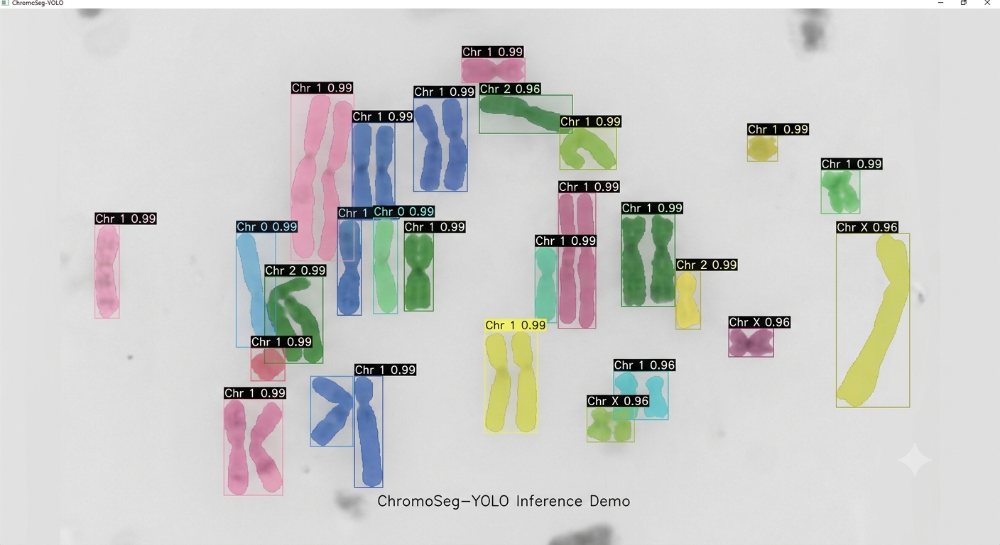

# ChromoSeg-YOLO
Real-Time Instance Segmentation & Automated Cytogenetics Engine

## Overview
ChromoSeg-YOLO is an open-source, high-throughput computer vision pipeline engineered 
for real-time instance segmentation and classification of human metaphase chromosomes 
and cellular nuclei. 

Built on PyTorch and modern object detection paradigms, ChromoSeg-YOLO addresses 
key challenges in automated cytogenetics—specifically severe chromosome overlap, 
variable fluorescence contrast, and complex morphological boundaries—to accelerate 
karyotyping workflows and biological feature extraction.

<div align="center">
  
  <p><em>Real-time instance segmentation on metaphase chromosome spread using ChromoSeg-YOLO.</em></p>
</div>


## Key Features
* Custom Boundary-Aware Loss: Integrated Dice-Focal and IoU loss functions tailored 
  for fine-grained overlapping biological boundaries.
* Bio-Augmentation Pipeline: Custom PyTorch transformations including elastic 
  deformations and fluorescence intensity jittering.
* High-Speed Export: Optimized inference engine exported via ONNX Runtime and 
  TensorRT for fast deployment.
* Comprehensive Benchmarking: Full experiment tracking integration via Weights & Biases, 
  comparing mAP@50-95, FPS latency, and memory footprint against standard baselines.

## Architecture
```
chromoseg/
├── data/          # COCO/Bio-Formats parsers & bio-augmentations
├── models/        # PyTorch backbones, attention heads, and custom loss layers
├── engine/        # Modular trainer, evaluator, and metric loggers
├── deploy/        # ONNX export and runtime wrappers
└── benchmarks/    # Comparison scripts and W&B logging artifacts
```

## License
Distributed under the GNU Affero General Public License v3.0 (AGPL-3.0). 
See `LICENSE` for more information.
